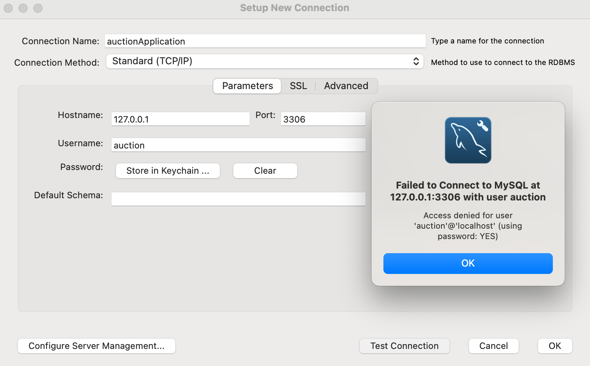
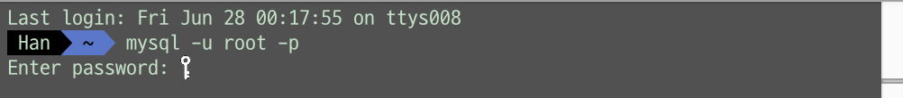
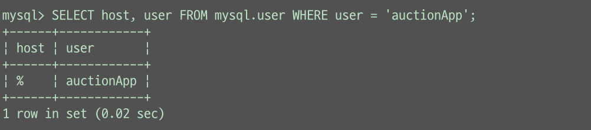
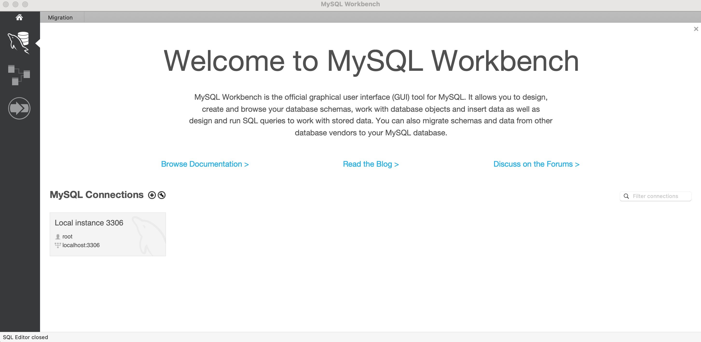
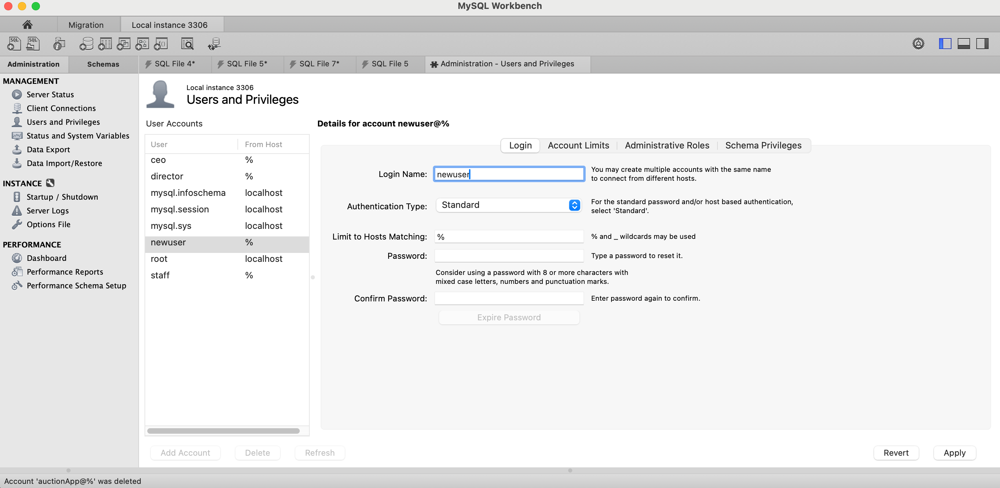
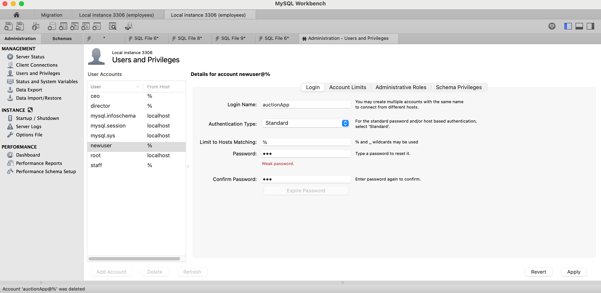
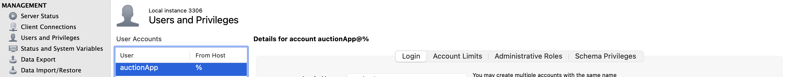
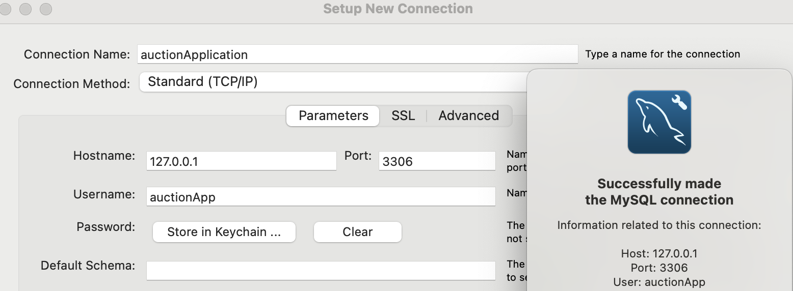
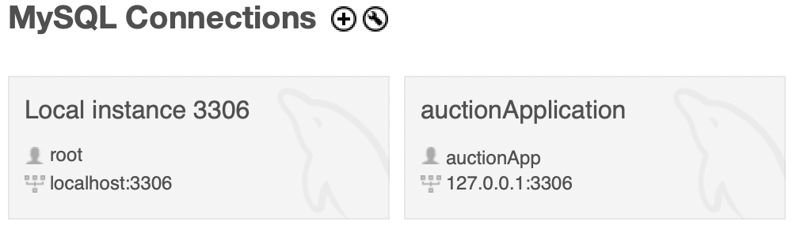

> MySQL Workbench에서 새로운 커넥션을 만드는 과정 중 에러가 발생했다.  
Access denied for user '유저아이디'@'localhost' (using password: yes)  

  

**결론 : 구글링 하면서 이것저것 다 해봤는데 권한 문제였다.**  
 

**root 사용자로 접속 :** `mysql -u root -p`
  
 

**유저아이디 권한 확인 :** `SELECT host, user FROM mysql.user WHERE user = '유저아이디';`
  
 

**권한 부여 :** `GRANT ALL PRIVILEGES ON DB명.* TO '유저아이디'@'localhost' IDENTIFIED BY '비밀번호';`  

  
**MySql 8.0 이후부터는 계정 생성과 권한 부여를 한 번에 할 수 없다고 한다. 위의 생성, 권한 과정을 분리해야 함**  
 

**root 계정 접속**
  
 

**Users and Privileges 탭으로 이동 후 Add account**
  
 

**유저아이디와 비밀번호 입력 후 Apply**

  
 

**생성 결과**
  
 

**메인 화면 Setup New Connection**
  
 

**성공 화면**
  
 

---

**참고 블로그**  

- [손지민 블로그 - ERROR 1064(42000)](https://velog.io/@s0nnyday/posts)
- [오늘의 개발 블로그 - Access denied for user '유저아이디'](https://oneul-losnue.tistory.com/108)
- [myeonji 블로그 - Access denied for user '유저아이디'](https://velog.io/@rladuswl/MySQL-%EC%97%B0%EB%8F%99-%EC%97%90%EB%9F%AC)