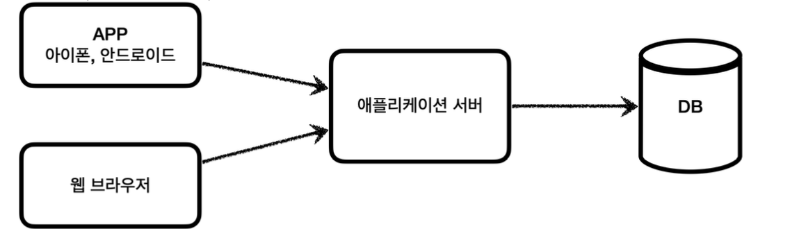
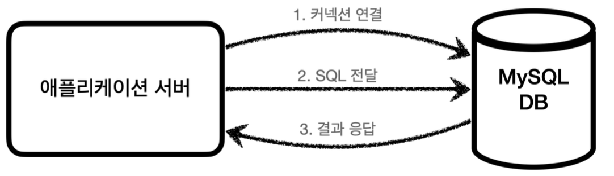
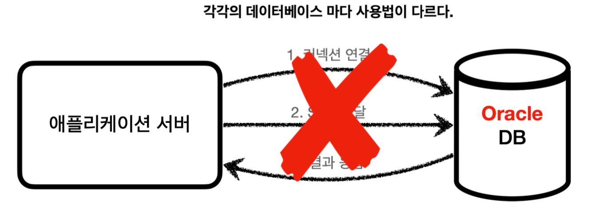
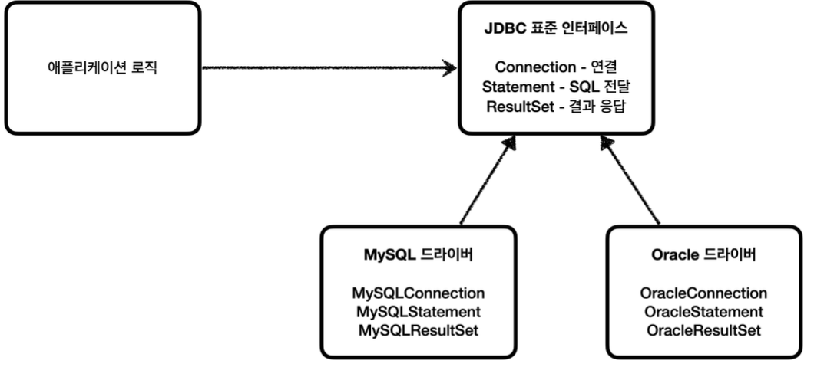
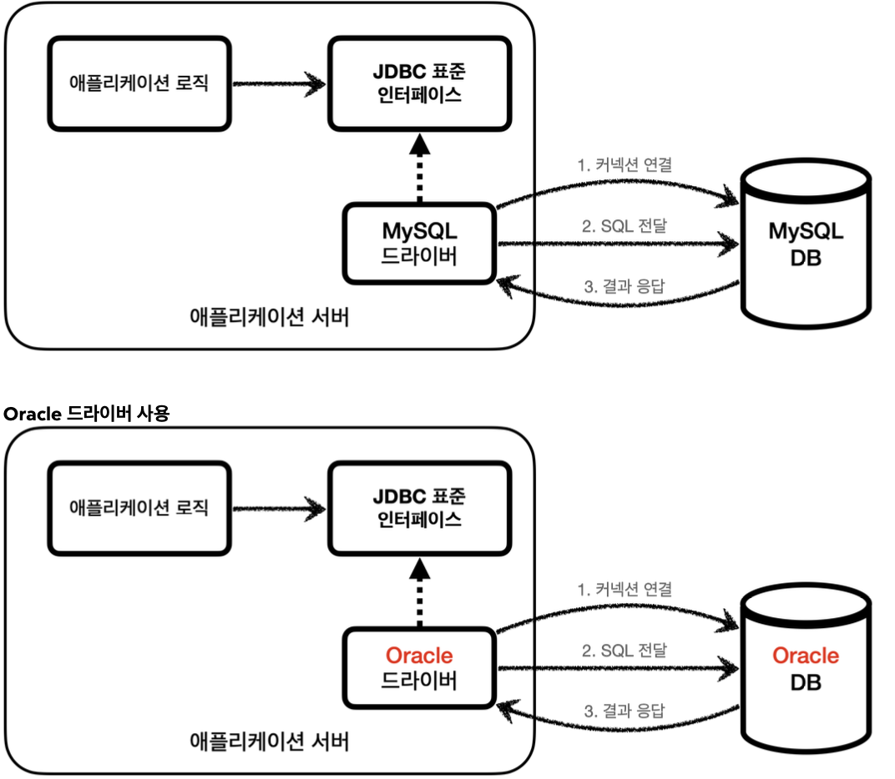
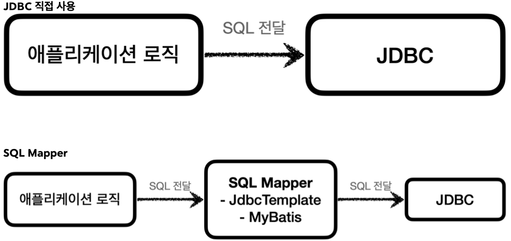
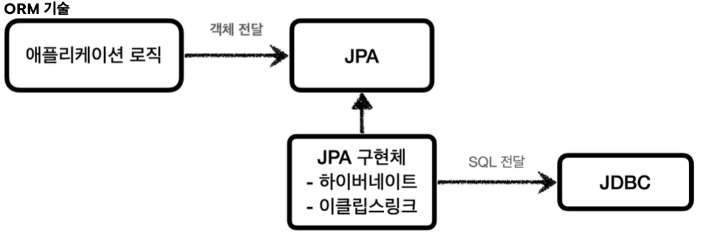
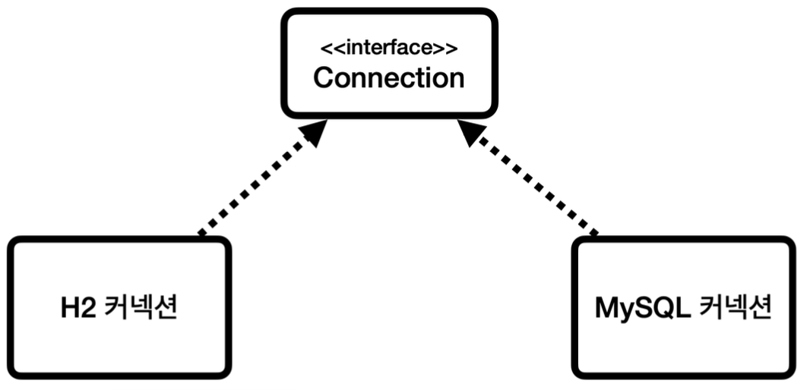
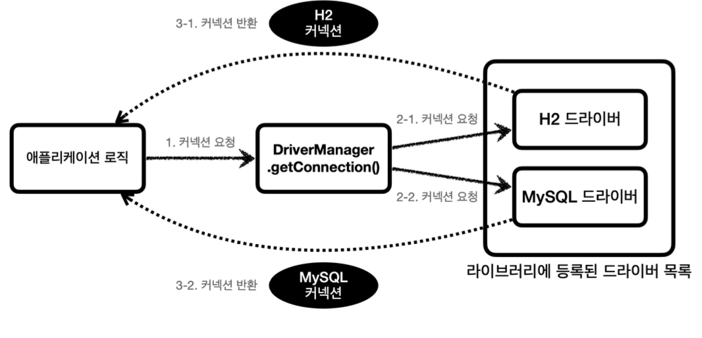
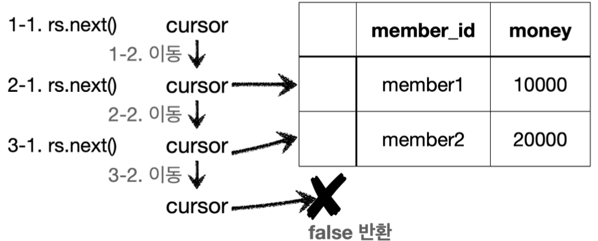

---

<h3 id = "등장이유"><b>JDBC 등장 이유</b></h3>

**클라이언트, 애플리케이션, DB 구조**

<pre>
애플리케이션을 개발할 때 중요한 데이터는 대부분 데이터베이스 보관한다.


</pre>

**일반적인 사용법**

<pre>
클라이언트가 애플리케이션 서버를 통해 데이터를 저장하거나 조회하면 애플리케이션 서버는 다음 과정을 통해서 DB를 사용한다.

1. 커넥션 연결 : 주로 TCP/IP를 사용해서 커넥션을 연결한다.
2. SQL 전달 : 애플리케이션 서버는 DB가 이해할 수 있는 SQL을 연결된 커넥션을 통해 DB에 전달한다.
3. 결과 응답 : DB는 전달된 SQL을 수행하고 그 결과를 응답한다. 애플리케이션 서버는 응답 결과를 활용한다.


</pre>

**DB 변경**

<pre>
그러나 각각의 DB마다 커넥션을 연결하는 방법, SQL을 전달하는 방법, 결과를 응답받는 방법이 모두 다르기에
다음과 같은 문제들이 발생한다.

1. 데이터베이스를 다른 종류로 변경하게 되면 서버에서 개발한 데이터베이스 사용 코드도 함께 변경해야 한다.
2. 개발자가 데이터베이스마다 커넥션 연결, SQL 전달 방법, 결과 응답 방법을 모두 새로 학습해야하는 불편함이 있다.

이러한 문제들을 해결하기 위해 "JDBC"라는 자바 표준이 등장한다.

</pre>

<h3 id = "JDBC 표준 인터페이스"><b>JDBC 표준 인터페이스</b></h3>

<pre>
JDBC(Java Database Connectivity)는 자바에서 데이터베이스에 접속할 수 있도록 하는 자바 API다.


</pre>


<pre>
대표적으로 다음 3가지 기능을 표준 인터페이스로 정의해서 제공한다.

java.sql.Connection - 연결
java.sql.Statement  - SQL을 담은 내용 전달
java.sql.ResultSet  - SQL 요청 응답

자바는 위의 그림처럼 표준 인터페이스를 정의해두었으며 개발자는 이 표준 인터페이스를 사용하여 개발하면 된다.
그런데 인터페이스만 있다고해서 동작하지는 않는다. 이 JDBC 인터페이스를 여러 데이터베이스 회사에서
자신들의 DB에 맞도록 구현하여 라이브러리를 제공하는데 이를 "JDBC 드라이버"라고 한다.
예를 들어 MySQL DB에 접근 할 수 있는 것은 MySQL JDBC 드라이버라고 하고 Oracle DB에
접근 할 수 있는 것은 Oracle JDBC 드라이버라고 하며 개발자들은 현재 사용하고 있는 DB에 맞도록
구현된 JDBC 드라이버를 사용하면 된다.

</pre>
**MySQL 드라이버 사용**

<pre>
JDBC의 등장으로 이전의 2가지 문제가 해결되었다.

1. 데이터베이스를 다른 종류로 변경하게 되면 서버에서 개발한 데이터베이스 사용 코드도 함께 변경해야하는 문제
    - 애플리케이션 로직은 이제 JDBC 표준 인터페이스에만 의존하면 된다. 다른 DB로 변경하고 싶다면
      JDBC 구현 라이브러리(JDBC 드라이버)만 변경하면 된다. 따라서 DB를 변경해도 애플리케이션 서버의
      코드를 그대로 유지할 수 있다.

2. 개발자가 데이터베이스마다 커넥션 연결, SQL 전달 방법, 결과 응답 방법을 모두 새로 학습해야하는 불편함
    - 개발자는 JDBC 표준 인터페이스 사용법만 학습하면 된다.

</pre>
<pre>
JDBC의 등장으로 많은 것이 편리해졌지만 각각의 DB마다 SQL, 데이터타입 등 일부 사용법이 다르다.
ANSI SQL이라는 표준이 존재하나 한계가 있으며 페이징 SQL은 각각의 DB마다 사용법이 다르다.
결국 DB를 변경하면 JDBC 코드는 변경하지 않아도 되지만 SQL은 해당 DB에 맞도록 변경해야 한다.

</pre>

<h3 id = "JDBC와 최신 데이터 접근 기술"><b>JDBC와 최신 데이터 접근 기술</b></h3>
<pre>
JDBC는 오래된 기술이며 사용하는 방법도 복잡하다. 그래서 최근에는 JDBC를 직접 사용하기보다는
JDBC를 편리하게 사용하는 다양한 기술이 존재하며 대표적으로 SQL Mapper와 ORM 기술로 나눌 수 있다.

</pre>


<pre>
SQL Mapper
    장점
        - JDBC를 편리하게 사용하도록 도와준다.
        - SQL 응답 결과를 객체로 편리하게 반환해준다.
        - JDBC의 반복 코드를 제거해준다.
    단점
        - 개발자가 SQL을 직접 작성해야 한다.
    대표 기술
        - 스프링 JdbcTemplate, Mybatis

</pre>


<pre>
ORM 기술
    장점
        - ORM은 객체를 관계형 데이터베이스 테이블과 매핑해주는 기술이다. 이 기술 덕분에
          SQL을 직접 작성하지 않으며 ORM 기술이 개발자 대신에 SQL을 동적으로 만들어 실행한다.
          추가로 이전에 각각의 DB마다 다른 SQL을 사용하는 문제도 해결해준다.
    대표 기술
        - JPA, Hibernate, EclipseLink
          JPA는 자바 진영의 ORM 표준 인터페이스이고 이것을 구현한 것으로 Hibernate, EclipseLink 등의
          구현 기술이 있다.
</pre>

**SQL Mapper VS ORM 기술**
<pre>
SQL Mapper와 ORM 기술 둘 다 각각 장단점이 있다.
SQL Mapper는 SQL만 직접 작성하면 나머지는 SQL Mapper가 대신 해결해주며 상대적으로 쉬운 난이도라고 한다.
ORM 기술은 SQL 자체를 작성하지 않아도 돼서 개발 생산성이 높아진다. 편리하지만 쉬운 기술은 아니라고 한다.
이후에 SQL Mapper인 JdbcTemplate와 MyBatis, ORM 기술인 JPA도 학습하여 활용 해보려 한다.
</pre>

<h3 id = "Database 연결"><b>데이터베이스 연결</b></h3>

**ConnectionConst**
```java
    public abstract class ConnectionConst {
        public static final String URL = "jdbc:h2:tcp://localhost/~/test";
        public static final String USERNAME = "sa";
        public static final String PASSWORD = "";
}
```
<pre>
데이터베이스에 접속하는데 필요한 기본 정보를 상수로 생성

</pre>

**DBConnectionUtil**
```java
    @Slf4j
    public class DBConnectionUtil {
        public static Connection getConnection() {
            try {
                Connection connection = DriverManager.getConnection(URL, USERNAME,PASSWORD);
                log.info("get connection={}, class={}", connection,
                connection.getClass());
                return connection;
            } catch (SQLException e) {
              throw new IllegalStateException(e);
            }
        }
   }
```
<pre>
데이터베이스에 연결하려면 JDBC가 제공하는 DriverManager.getConnection()을 사용하면 된다.
이렇게 하면 라이브러리에 있는 데이터베이스 드라이버를 찾아서 해당 드라이버가 제공하는 커넥션을 반환해준다.

</pre>

**DBConnectionUtilTest**
```java
@Slf4j
  class DBConnectionUtilTest {
      @Test
      void connection() {
          Connection connection = DBConnectionUtil.getConnection();
          assertThat(connection).isNotNull();
      }
}
```
**실행 결과**
```console
 DBConnectionUtil - get connection=conn0: url=jdbc:h2:tcp://localhost/~/test
  user=SA, class=class org.h2.jdbc.JdbcConnection
```
<pre>
테스트 코드 실행 결과 class=class org.h2.jdbc.JdbcConnection을 확인 할 수 있다.
이것이 H2 데이터베이스 드라이버가 제공하는 커넥션이다.

</pre>

<h3 id = "JDBC DriverManager 연결 이해"><b>JDBC DriverManager 연결 이해</b></h3>
<pre>
지금까지 코드로 확인해본 과정을 자세히 알아보자

</pre>

**JDBC 커넥션 인터페이스와 구현**

<pre>
JDBC는 java.sql.Connection 표준 커넥션 인터페이스를 정의한다.
H2 데이터베이스 드라이버는 JDBC Connection 인터페이스를 구현한 org.h2.jdbc.JdbcConnection구현체를 제공한다

</pre>

**DriverManager 커넥션 요청 흐름**

<pre>
JDBC가 제공하는 DriverManager는 라이브러리에 등록된 DB 드라이버들을 관리하고 커넥션을 획득하는 기능을 제공한다.

1. 애플리케이션 로직에서 커넥션이 필요하면 DriverManager.getConnection()을 호출한다.
2. DriverManager는 라이브러리에 등록된 드라이버 목록을 자동으로 인식한다. 이 드라이버들에게 순서대로
   아래의 정보를 넘겨서 커넥션을 획득 할 수 있는지 확인한다.
   URL : 예시) "jdbc:h2:tcp://localhost/~/test"
   이름, 비밀번호 등 접속에 필요한 추가 정보 : 예시) "sa",""
   
   각각의 드라이버들은 URL 정보를 체크하여 본인이 처리할 수 있는 요청인지 확인한다.
   URL이 jdbc:h2로 시작하고 이것은 h2 데이터베이스에 접근하기 위한 규칙이다.
   따라서 H2 드라이버가 처리할 수 있으므로 데이터베이스에 연결하여 커넥션을 획득하고 클라이언트에 반환한다.
   만약 URL이 jdbc:h2로 시작하는데 MySQL 드라이버가 먼저 실행되면 본인이 처리할 수 없다는 결과를
   반환하고 다음 드라이버에게 순서가 넘어간다.
3. 찾은 커넥션 구현체가 클라이언트에 반환된다.

</pre>
<h3 id = "JDBC 개발-등록"><b>JDBC 개발 - 등록</b></h3>
<pre>
JDBC를 사용해서 회원(Member) 데이터를 데이터베이스에서 관리하는 기능을 만들어보자
</pre>

**schema.sql**
```sql
drop table member if exists cascade;
  create table member (
      member_id varchar(10),
      money integer not null default 0,
      primary key (member_id)
);
```

**Member**
```java
@Data
    public class Member {
        private String memberId;
        private int money;
        public Member() {
        }
        public Member(String memberId, int money) {
            this.memberId = memberId;
            this.money = money;
        } 
    }
```

**MemberRepositoryV0 - 회원 등록**
```java
package hello.jdbc.repository;

import hello.jdbc.connection.DBConnectionUtil;
import hello.jdbc.domain.Member;
import lombok.extern.slf4j.Slf4j;

import java.sql.*;
import java.util.NoSuchElementException;

/**
 * JDBC - DriverManager 사용
 */
@Slf4j
public class MemberRepositoryV0 {

    public Member save(Member member) throws SQLException {
        String sql = "insert into member(member_id, money) values (?, ?)";

        Connection con = null;
        PreparedStatement pstmt = null;

        try {
            con = getConnection();
            pstmt = con.prepareStatement(sql);
            pstmt.setString(1, member.getMemberId());
            pstmt.setInt(2, member.getMoney());
            pstmt.executeUpdate();
            return member;
        } catch (SQLException e) {
            log.error("db error", e);
            throw e;
        } finally {
            close(con, pstmt, null);
        }
    }

    private void close(Connection con, Statement stmt, ResultSet rs) {

        if (rs != null) {
            try {
                rs.close();
            } catch (SQLException e) {
                log.info("error", e);
            }
        }

        if (stmt != null) {
            try {
                stmt.close();
            } catch (SQLException e) {
                log.info("error", e);
            }
        }

        if (con != null) {
            try {
                con.close();
            } catch (SQLException e) {
                log.info("error", e);
            }
        }
    }

    private static Connection getConnection() {
        return DBConnectionUtil.getConnection();
    }
}
```
**커넥션 획득 및 save() 메소드 SQL 전달**
<pre>
getConnection() : 이전에 만들어둔 DBConnectionUtil에서 데이터베이스 커넥션을 획득한다.
sql : 데이터베이스에 전달할 SQL을 정의한다.
con.prepareStatement(sql) : 데이터베이스에 전달할 SQL과 파라미터로 전달할 데이터들을 준비한다.
    sql : "insert into member(member_id, money) values(?, ?)"
    pstmt.setString(1, member.getMemberId()) : SQL의 첫번째 ?에 값을 지정한다.
    pstmt.setInt(2, member.getMoney()) : SQL의 두번째 ?에 값을 지정한다.
    pstmt.executeUpdate() : Statement를 통해 준비된 SQL을 커넥션을 통해 실제 데이터베이스에 전달한다. 

</pre>

**리소스 정리**
<pre>
쿼리를 실행하고 나면 리소스를 정리해야한다. 위의 코드에서 Connection, PreparedStatement를 사용했다.
리소스는 항상 역순으로 정리를 해야한다. Connection을 획득하고 Connection으로 PreparedStatement를
만들었기 때문에 PreparedStatement를 먼저 종료하고 그 다음에 Connection을 종료하면 된다.

</pre>

**주의**
<pre>
리소스 정리는 예외가 발생하든, 발생하지 않든 항상 수행되어야 하기에 finally 구문에 작성을 하였다.
만약 이 부분을 놓쳐 커넥션이 끊어지지 않고 계속 유지되는 문제가 발생할 수 있는데 이를 "리소스 누수"라 한다.
이러한 문제는 결과적으로 커넥션 부족으로 에러가 발생할 수 있다.

</pre>

**MemberRepositoryV0Test - 회원 등록**
```java
package hello.jdbc.repository;
import hello.jdbc.domain.Member;
import org.junit.jupiter.api.Test;
import java.sql.SQLException;
class MemberRepositoryV0Test {
    MemberRepositoryV0 repository = new MemberRepositoryV0();
    @Test
    void crud() throws SQLException {
    //save
    Member member = new Member("memberV0", 10000);
    repository.save(member);
    }
}
```

<h3 id = "JDBC 개발-조회"><b>JDBC 개발 - 조회</b></h3>

**MemberRepositoryV0 - 회원 조회 추가**
```java
public Member findById(String memberId) throws SQLException {
        String sql = "select * from member where member_id = ?";

        Connection con = null;
        PreparedStatement pstmt = null;
        ResultSet rs = null;

        try {
            con = getConnection();
            pstmt = con.prepareStatement(sql);
            pstmt.setString(1, memberId);

            rs = pstmt.executeQuery();
            if (rs.next()) {
                Member member = new Member();
                member.setMemberId(rs.getString("member_id"));
                member.setMoney(rs.getInt("money"));
                return member;
            } else {
                throw new NoSuchElementException("member not found memberId=" + memberId);
            }
        } catch (SQLException e) {
            log.error("db error", e);
            throw e;
        } finally {
            close(con, pstmt, rs);
        }
    }
```
<pre>
MemberRepositoryV0 - 회원 조회 코드에 위의 코드를 추가해보자
sql : 데이터 조회를 위한 select SQL문을 작성한다.
rs = pstmt.executeQuery() : 데이터를 변경할 때는 executeUpdate()를 사용하지만
데이터를 조회 할 때는 executeQuery()를 사용한다. executeQuery()는 결과를 ResultSet에 담아서 반환한다.

</pre>

**ResultSet**

<pre>
ResultSet 내부에 있는 커서(cursor)를 이동해서 다음 데이터를 조회할 수 있다.
rs.next() : 커서가 다음으로 이동한다. 커서는 처음에 데이터를 가리키고 있지 않기 때문에 rs.next()를
한번은 호출해야 데이터를 조회할 수 있다.

위의 이미지의 예시는 회원이 2명 조회되는 경우이다.
1. 1-1에서 rs.next()를 호출한다.
2. 1-2의 결과로 cursor가 다음으로 이동한다. 이 경우 cursor가 가리키는 데이터가 있으므로 true를 반환한다.
3. 2-1에서 rs.next()를 호출한다.
4. 2-2의 결과로 cursor가 다음으로 이동한다. 이 경우 cursor가 가리키는 데이터가 있으므로 true를 반환한다.
5. 3-1에서 rs.next()를 호출한다.
6. 3-2의 결과로 cursor가 다음으로 이동한다. 이 경우 cursor가 가리키는 데이터가 없으므로 false를 반환한다.

</pre>

**MemberRepositoryV0Test - 회원 조회 추가**
```java
package hello.jdbc.repository;
import hello.jdbc.domain.Member;
import lombok.extern.slf4j.Slf4j;
import org.junit.jupiter.api.Test;
import java.sql.SQLException;
import static org.assertj.core.api.Assertions.assertThat;
@Slf4j
class MemberRepositoryV0Test {
    MemberRepositoryV0 repository = new MemberRepositoryV0();
    @Test
    void crud() throws SQLException {
    //save
    Member member = new Member("memberV0", 10000);
    repository.save(member);

    //findById
    Member findMember = repository.findById(member.getMemberId());
    log.info("findMember={}", findMember);
    assertThat(findMember).isEqualTo(member);
    } 
}
```

<h3 id = "JDBC 개발-수정,삭제"><b>JDBC 개발 - 수정,삭제</b></h3>
<pre>
수정과 삭제는 등록과 비슷하다. 등록, 수정, 삭제처럼 데이터를 변경하는 쿼리는 executeUpdate()를 사용한다.
</pre>

**MemberRepositoryV0 - 회원 수정 추가**
```java
public void update(String memberId, int money) throws SQLException {
    String sql = "update member set money=? where member_id=?";
    Connection con = null;
    PreparedStatement pstmt = null;
    try {
        con = getConnection();
        pstmt = con.prepareStatement(sql);
        pstmt.setInt(1, money);
        pstmt.setString(2, memberId);
        int resultSize = pstmt.executeUpdate();
        log.info("resultSize={}", resultSize);
    } catch (SQLException e) {
        log.error("db error", e);
        throw e;
      } finally {
        close(con, pstmt, null);
        } 
}
```
<pre>
executeUpdate()는 쿼리를 실행하고 영향받은 row수를 반환한다. 위의 코드에서는 하나의 데이터만 변경하기 때문에
결과로 1이 반환된다. 만약 회원이 100명이고 모든 회원의 데이터를 한번에 수정하는 sql문을 실행하면 결과는 100이 된다.

</pre>

**MemberRepositoryV0Test - 회원 수정 추가**
```java
@Test
void crud() throws SQLException {
    //save
    Member member = new Member("memberV0", 10000);
    repository.save(member);

    //findById
    Member findMember = repository.findById(member.getMemberId());
    assertThat(findMember).isEqualTo(member);

    //update: money: 10000 -> 20000
    repository.update(member.getMemberId(), 20000);
    Member updatedMember = repository.findById(member.getMemberId());
    assertThat(updatedMember.getMoney()).isEqualTo(20000);
}
```
<pre>
회원 데이터의 money를 10000 -> 20000으로 수정 후 DB에서 데이터를 조회하여 20000으로 변경 되었는지 검증한다.

</pre>

**MemberRepositoryV0 - 회원 삭제 추가**
```java
public void delete(String memberId) throws SQLException {
    String sql = "delete from member where member_id=?";
    Connection con = null;
    PreparedStatement pstmt = null;
    try {
        con = getConnection();
        pstmt = con.prepareStatement(sql);
        pstmt.setString(1, memberId);
        pstmt.executeUpdate();
    } catch (SQLException e) {
        log.error("db error", e);
        throw e;
    } finally {
        close(con, pstmt, null);
    }   
}
```
<pre>
이전의 회원 수정 코드와 sql 쿼리문만 변경되고 내용은 거의 동일하다.

</pre>

**MemberRepositoryV0Test - 회원 삭제 추가**
```java
package hello.jdbc.repository;
import hello.jdbc.domain.Member;
import lombok.extern.slf4j.Slf4j;
import org.junit.jupiter.api.Test;
import java.sql.SQLException;
import java.util.NoSuchElementException;
import static org.assertj.core.api.Assertions.assertThat;
import static org.assertj.core.api.Assertions.assertThatThrownBy;
@Slf4j
class MemberRepositoryV0Test {
    MemberRepositoryV0 repository = new MemberRepositoryV0();
    @Test
    void crud() throws SQLException {
    //save
    Member member = new Member("memberV0", 10000);      
    repository.save(member);

    //findById
    Member findMember = repository.findById(member.getMemberId());
    log.info("findMember={}", findMember);
    assertThat(findMember).isEqualTo(member);

    //update: money: 10000 -> 20000
    repository.update(member.getMemberId(), 20000);
    Member updatedMember = repository.findById(member.getMemberId());
    assertThat(updatedMember.getMoney()).isEqualTo(20000);

    //delete
    repository.delete(member.getMemberId());
    assertThatThrownBy(() -> repository.findById(member.getMemberId()))
    .isInstanceOf(NoSuchElementException.class);
    }
}
```
<pre>
회원을 삭제한 다음 findById()를 통해서 조회한다. findById() 메소드에서 회원이 없을 경우
throw new NoSuchElementException()로 예외를 던지도록 작성을 했었다.
정상적으로 삭제를 했다면 회원이 없기 때문에 NoSuchElementException이 발생한다.
assertThatThrownBy는 지정한 예외가 발생해야 검증에 성공한다.
</pre>