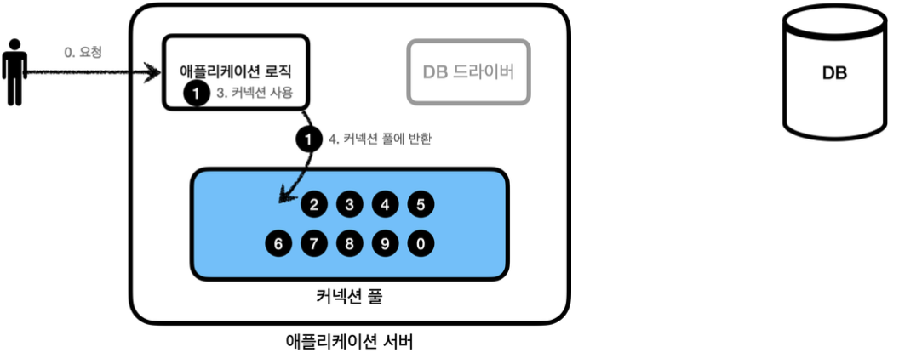

---

<h3 id = "커넥션 풀 이해"><b>커넥션 풀 이해</b></h3>

**데이터 커넥션을 매번 획득**

<pre>
데이터베이스 커넥션을 획득할 때 다음과 같은 복잡한 과정을 거친다.

1. 애플리케이션 로직은 DB 드라이버를 통해 커넥션을 조회한다.
2. DB 드라이버는 DB와 TCP/IP 커넥션 연결을 한다.
3. DB 드라이버는 TCP/IP 커넥션이 연결되면 ID, PW와 기타 부가정보를 DB에 전달한다.
4. DB는 ID, PW를 통해 내부 인증을 완료하고, 내부에 DB 세션을 생성한다.
5. DB는 커넥션 생성이 완료되었다는 응답을 보낸다.
6. DB 드라이버는 커넥션 객체를 생성해서 클라이언트에 반환한다.

이렇게 커넥션을 새로 만드는 과정은 복잡하며 시간도 많이 소모되는 일이다.
또한 사용자가 애플리케이션을 사용할 때 SQL 실행 시간뿐만 아니라 커넥션 생성 시간이 추가된다면 응답 속도에 영향을 준다.
처리 속도가 느린 애플리케이션을 쓰고 싶은 사람은 없을 것이다.

이러한 문제를 해결하기 위한 방법이 커넥션을 미리 생성해두고 사용하는 "커넥션 풀"이라는 방법이다.
커넥션 풀은 이름 그대로 커넥션을 관리하는 풀이다.

</pre>

**커넥션 풀 초기화**

<pre>
애플리케이션을 시작하는 시점에 커넥션 풀은 필요한만큼 커넥션을 미리 생성하여 풀에 보관한다.
커넥션을 몇 개나 보관할지는 서비스의 특징과 서버 스펙에 따라 다르지만 기본값은 보통 10개이다.

</pre>

**커넥션 풀의 연결 상태**

<pre>
커넥션 풀에 들어있는 커넥션은 TCP/IP로 DB와 커넥션이 되어있는 상태이기 때문에 언제든지 SQL을 DB에 전달할 수 있다.

</pre>

**커넥션 풀 사용1**

<pre>
이제 애플리케이션 로직에서 DB 드라이버를 통해서 새로운 커넥션을 획득하는 것이 아니라 커넥션 풀을 통해 이미
생성되어 있는 커넥션을 객체 참조로 가져다 쓰기만 하면 된다. 커넥션 풀에 커넥션을 요청하면 커넥션 풀은
자신이 가지고 있는 커넥션 중 하나를 반환한다.

</pre>

**커넥션 풀 사용2**

<pre>
애플리케이션 로직은 커넥션 풀에서 받은 커넥션을 사용해서 SQL을 데이터베이스에 전달하고 결과를 응답받아 처리한다.
커넥션을 사용하고 나면 이제는 커넥션을 종료하는 것이 아니라 다시 커넥션 풀에 반납하여 다시 사용이 가능하도록 한다.

</pre>

<pre>
정리
- 커넥션 풀 숫자는 서비스의 특징과 애플리케이션 서버 스펙, DB 스펙에 따라 다르기 때문에 성능 테스트를 통해 정해야한다.
- 커넥션 풀은 서버당 최대 커넥션 수를 제한할 수 있다. 따라서 DB에 무한정 연결이 생성되는 것을 막아 보호한다.
- 대표적인 커넥션 풀 오픈소스는 commons-dbcp2, tomcat-jdbc pool, HikariCP 등이 있다.

</pre>

<h3 id = "DataSource 이해"><b>DataSource 이해</b></h3>
<pre>
커넥션을 얻는 방법은 이전에 학습한 JDBC DriverManager를 직접 사용하거나 커넥션 풀을 사용하는 방법 등이 존재한다.

</pre>

**커넥션을 획득하는 다양한 방법**

 

**DriverManager를 통해 커넥션 획득**

<pre>
이전 어플리케이션에서 JDBC DriverManager를 통해 커넥션을 획득했었다. 이를 커넥션 풀로 변경하려면 어떻게 해야할까?

</pre>

**DriverManager를 통해 커넥션을 획득하다가 커넥션 풀로 변경시 문제**

<pre>
애플리케이션 로직에서 DriverManager를 통해 커넥션을 획득하다가 HikariCP 같은 커넥션 풀을 사용하도록 변경하면
커넥션을 획득하는 애플리케이션 로직에서도 코드의 변경이 필요해진다.
의존관계를 DriverManager에서 HikariCP로 변경해야 하며 이러한 코드 수정은 번거로우며 실수를 불러왔다.
이러한 문제를 해결 하기 위해 커넥션을 획득하는 방법을 추상화하였다. 

</pre>

**커넥션을 획득하는 방법을 추상화**

<pre>
자바에서는 위의 문제를 해결하기 위해 java.sql.DataSource라는 인터페이스를 제공한다.
DataSource는 커넥션을 획득하는 방법을 추상화하는 인터페이스다.

정리
- 대부분의 커넥션 풀은 DataSource 인터페이스를 구현해두었다. 따라서 개발자는 특정 커넥션에 직접 의존하는 것이 아니라
  DataSource 인터페이스에만 의존하도록 애플리케이션 로직을 작성하면 된다.

- 커넥션 풀 구현 기술을 변경하고 싶다면 해당 구현체로 갈아끼우기만 하면 된다.

- DriverManager는 DataSource 인터페이스를 사용하지 않는다. 따라서 DriverManager는 직접 사용해야 한다.
  따라서 DriverManager를 사용하다가 DataSource 기반의 커넥션 풀로 변경하려면 관련 코드를 모두 고쳐야 한다.
  이러한 문제를 해결하기 위해 스프링은 DriverManager도 DataSource를 통해서 사용할 수 있도록
  "DriverManagerDataSource"라는 DataSource를 구현한 클래스를 제공한다.

- 자바는 DataSource를 통해 커넥션을 획득하는 방법을 추상화했다. 이제 애플리케이션 로직은 DataSource 인터페이스만
  의존하면 된다. 덕분에 DriverManagerDataSource를 통해 DriverManager를 사용하다가 커넥션 풀을 사용하도록
  코드를 변경하여도 애플리케이션 로직은 변하지 않는다.

</pre>

